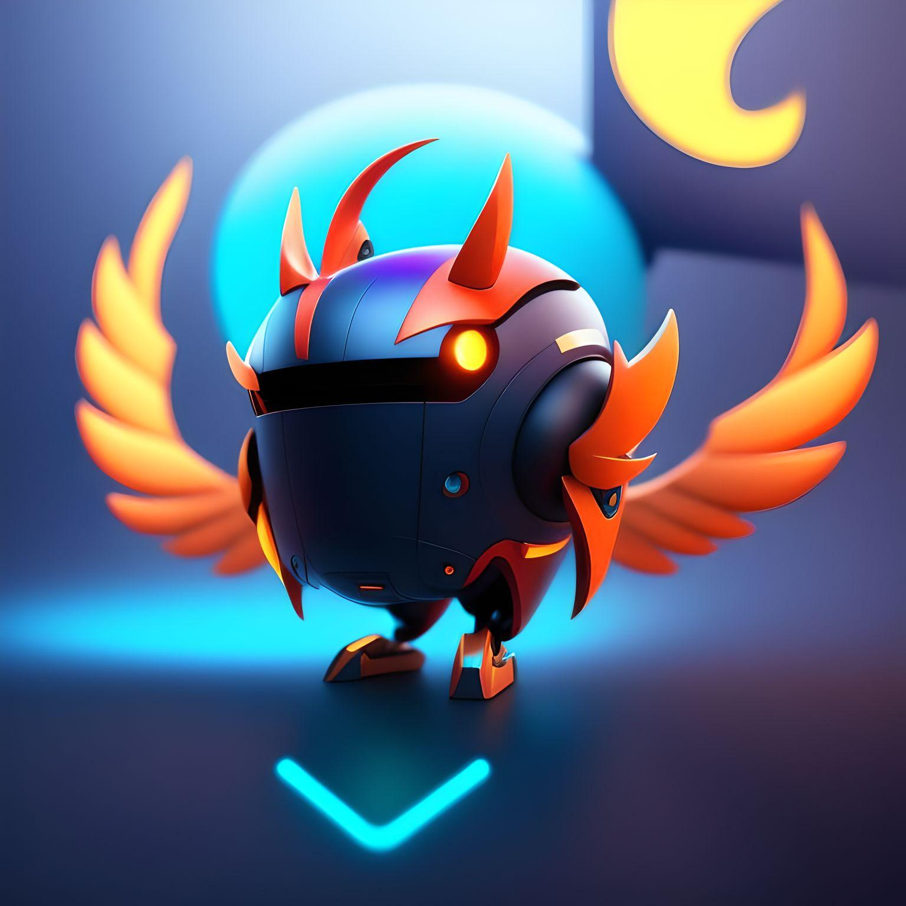

# Tweecord
Tweecord Bot: Real-time Twitter updates in Discord. Stay informed with tweets from influential accounts, effortlessly delivered to your server. Curate personalized streams, filter noise, and engage with high-quality content. Foster discussions, connect with shared interests. Empower your community with Tweecord Bot.
# Twitter Discord Bot

This is a Discord bot that retrieves tweets from influential Twitter accounts and posts them in a Discord channel.

## Prerequisites

- Node.js (version 12 or higher)
- Discord.js library
- Twit library

## Installation

1. Clone the repository:

   ```bash
   git clone https://github.com/root-Manas/twitter-discord-bot.git
   
2. cd tweecord
   
3. npm install

4. const consumerKey = 'Your key here';
   const consumerSecret = 'Your secret here';
   const accessToken = 'Your token here';
   const accessTokenSecret = 'Your token secret here';

5. node tweecord.js

6. The licensing information for Creative Commons v1.0 is now added at the end of the README.md file, providing details about the license and a link to the license text.

